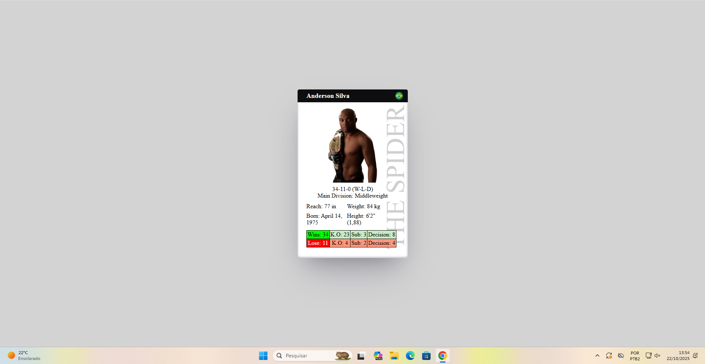

## Card de Lutador - Anderson Silva

Este projeto é um cartão de lutador para Anderson Silva, um dos maiores nomes do MMA, desenvolvido utilizando HTML e CSS. O objetivo é criar um cartão visualmente atraente e informativo, exibindo dados relevantes sobre o lutador.

## Desktop

## Mobile

**Funcionalidades:**

- **Layout Responsivo:** O cartão foi projetado para se adaptar a diferentes tamanhos de tela, garantindo uma boa experiência visual em dispositivos móveis e desktops.
- **Design Atraente:** Combina elementos visuais como imagem, cores e fontes para criar um cartão profissional e visualmente interessante.
- **Informações Completas:** Exibe informações relevantes como apelido, record, divisão principal, altura, peso, data de nascimento e alcance. 
- **Estatísticas de Vitórias e Derrotas:**  Apresenta a quantidade de vitórias e derrotas, separando por nocaute, finalização e decisão.

**Tecnologias Utilizadas:**

- **HTML:**  Estrutura do cartão e organização dos elementos.
- **CSS:**  Estilização do cartão, cores, fontes, posicionamento e layout responsivo.

**Para utilizar este projeto:**

1. **Baixe o código:**  Baixe o repositório para seu computador.
2. **Abra o arquivo HTML:**  Abra o arquivo "index.html" em um navegador da web.
3. **Visualize o cartão:** O cartão de lutador de Anderson Silva será exibido na tela.

**Observações:**

- As imagens utilizadas no projeto são retiradas do Google.

